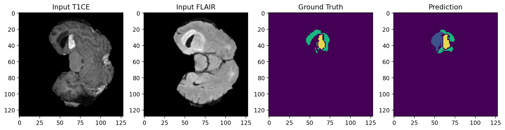

# ECE 228 Final Project - Group 20: Brain Tumor Segmentation using 2D Residual UNet

## Summary
This is our GitHub repository for ECE 228 Final Project. We implemented a 2D Residual UNet using PyTorch to perform brain tumor segmentation on the BraTS 2020 dataset. 

The dataset can be found at: [Kaggle BraTS 2020](https://www.kaggle.com/datasets/awsaf49/brats20-dataset-training-validation)

All 2D UNet models that we implemented can be found inside *model.py*.

Python packages required to run the notebook: **nibabel**, **opencv (cv2)**, **torch**, **sklearn**, **skimage**.

## Model Architecture

## Pre-activation ResNet Block

## Training Loop

## Example of our model's prediction
### Good predictions

### Bad predictions

